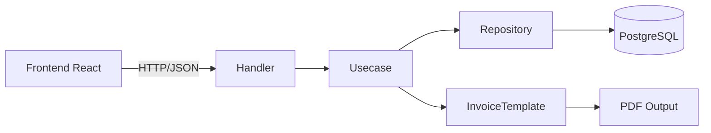

# Dokumen Desain: PPDB Payment & Improvements

## Ikhtisar

Dokumen ini menjabarkan desain teknis untuk sembilan fitur baru dan perbaikan pada Sistem Informasi Manajemen Sekolah Islam (SDIT-SIMS). Sistem ini dibangun dengan arsitektur clean architecture pada backend Go dan frontend React + TypeScript dengan database PostgreSQL.

Fitur-fitur yang didesain:
1. **Modul Pembayaran PPDB** — Pencatatan pembayaran calon siswa baru dengan mekanisme DP otomatis
2. **Bulk Pembuatan Akun** — Import massal pengguna via CSV
3. **Pembayaran Multi-Tagihan** — Satu transaksi untuk beberapa tagihan
4. **Invoice Ukuran A5** — Format cetak dua per halaman A4
5. **Tabungan per Kelas** — Filter dropdown kelas pada halaman tabungan
6. **Rekap Tabungan** — Laporan rekap per periode
7. **Penggantian Tanda Tangan Invoice** — Ganti "Ketua Yayasan" menjadi "Tata Usaha"
8. **Perbaikan Toast Notification** — Konsistensi notifikasi di seluruh aplikasi
9. **Pengelolaan Aset** — CRUD aset sekolah beserta rekap

---

## Arsitektur

Sistem mengikuti pola clean architecture yang sudah ada:

```
backend/
  cmd/api/              ← Entry point
  internal/
    domain/             ← Model & interface (models.go, invoice_models.go)
    repository/postgres/ ← Implementasi database
    usecase/            ← Business logic
    delivery/http/
      handlers/         ← HTTP handler (controller)
      routes/           ← Routing

frontend/
  src/
    pages/              ← Halaman React per modul
    services/api.ts     ← Axios instance
    utils/invoiceTemplate.ts ← PDF generator
    components/ui/      ← Komponen UI reusable
```

Setiap fitur baru mengikuti alur: **Domain Model → Repository → Usecase → Handler → Route → Frontend Page**.



---

## Komponen dan Antarmuka

### Req 1: Modul Pembayaran PPDB

**Backend:**
- Domain: `PPDBPayment`, `PPDBPaymentItem` di `models.go`
- Repository: `PPDBPaymentRepository` di `postgres/ppdb_payment_repository.go`
- Usecase: `PPDBPaymentUsecase` di `ppdb_payment_usecase.go`
- Handler: `PPDBPaymentHandler` di `handlers/ppdb_payment_handler.go`
- Routes: `POST /ppdb/payments`, `GET /ppdb/payments`, `GET /ppdb/payments/:id`, `PUT /ppdb/payments/:id`, `DELETE /ppdb/payments/:id`

**Frontend:**
- Halaman: `PPDBPayment.tsx` (tab baru di dalam `AdminPPDB.tsx`)
- Komponen: `PPDBPaymentForm`, `PPDBPaymentStatusBadge`

### Req 2: Bulk Pembuatan Akun

**Backend:**
- Usecase: method `BulkCreateUsers` di `UserUsecase`
- Handler: method `BulkCreateUsers` di `UserHandler`
- Route: `POST /users/bulk`

**Frontend:**
- Halaman: `BulkImport.tsx` di `pages/admin/`
- Utilitas: fungsi `parseCSV`, `downloadCSVTemplate`

### Req 3: Pembayaran Multi-Tagihan

**Backend:**
- Domain: `MultiBillPayment` (request struct)
- Usecase: method `ProcessMultiPayment` di `FinanceUsecase`
- Handler: method `MultiPayment` di `FinanceHandler`
- Route: `POST /finance/bills/multi-payment`

**Frontend:**
- Komponen: `MultiBillSelector` (checkbox list tagihan)
- Integrasi di halaman `Finance.tsx` atau `StudentBillSummary.tsx`

### Req 4: Invoice Ukuran A5

**Frontend:**
- Fungsi baru: `generateInvoiceA5` di `invoiceTemplate.ts`
- Fungsi baru: `generateInvoiceA5Double` (dua invoice per halaman A4)
- Opsi format cetak di komponen invoice yang sudah ada

### Req 5: Tabungan per Kelas

**Backend:**
- Modifikasi: tambah parameter `class_id` pada `GET /finance/savings/accounts`
- Modifikasi: query di `SavingsRepository.GetAccounts`

**Frontend:**
- Modifikasi: `Savings.tsx` — dropdown kelas sudah ada, perlu dihubungkan ke API

### Req 6: Rekap Tabungan

**Backend:**
- Repository: method `GetSavingsRecap` di `SavingsRepository`
- Usecase: method `GetSavingsRecap` di `SavingsUsecase`
- Handler: method `GetSavingsRecap` di `SavingsHandler`
- Route: `GET /finance/savings/recap`

**Frontend:**
- Panel baru: `SavingsRecap.tsx` atau tab baru di `Savings.tsx`
- Ekspor PDF menggunakan `jsPDF`

### Req 7: Penggantian Tanda Tangan

**Frontend:**
- Modifikasi: `invoiceTemplate.ts` — ganti default `chairman` → `admin_tu`
- Modifikasi: label `'Ketua Yayasan'` → `'Tata Usaha'`
- Modifikasi: `KEYS` record — tambah key `admin_tu`

**Backend:**
- Modifikasi: seed/default data `StakeholderConfig` — ganti role `chairman` → `admin_tu`

### Req 8: Perbaikan Toast Notification

**Frontend:**
- Audit seluruh komponen yang menggunakan toast
- Pastikan hanya satu library toast (`react-hot-toast`) yang digunakan
- Pindahkan penanganan error ke interceptor Axios global di `services/api.ts`
- Hapus duplikasi toast error di handler lokal komponen

### Req 9: Pengelolaan Aset

**Backend:**
- Domain: `Asset`, `AssetCategory` (enum), `AssetStatus` (enum) di `models.go`
- Repository: `AssetRepository` di `postgres/asset_repository.go`
- Usecase: `AssetUsecase` di `asset_usecase.go`
- Handler: `AssetHandler` di `handlers/asset_handler.go`
- Routes: `POST /assets`, `GET /assets`, `GET /assets/:id`, `PUT /assets/:id`, `DELETE /assets/:id`, `GET /assets/recap`

**Frontend:**
- Halaman: `Assets.tsx` di `pages/admin/`
- Komponen: `AssetForm`, `AssetRecapPanel`

---

## Model Data

### PPDBPayment & PPDBPaymentItem

```go
// domain/models.go

type PPDBPayment struct {
    ID                   uuid.UUID          `gorm:"type:uuid;default:gen_random_uuid();primaryKey" json:"id"`
    PPDBRegistrationID   uuid.UUID          `gorm:"type:uuid;not null" json:"ppdb_registration_id"`
    PPDBRegistration     PPDBRegistration   `gorm:"foreignKey:PPDBRegistrationID" json:"ppdb_registration"`
    InvoiceNumber        string             `gorm:"unique;not null" json:"invoice_number"`
    TotalAmount          float64            `gorm:"not null;default:0" json:"total_amount"`
    PaidAmount           float64            `gorm:"not null;default:0" json:"paid_amount"`
    Status               string             `gorm:"not null;default:'Belum Bayar'" json:"status"` // Belum Bayar, DP Terpenuhi, Lunas
    Items                []PPDBPaymentItem  `gorm:"foreignKey:PPDBPaymentID" json:"items,omitempty"`
    CreatedAt            time.Time          `json:"created_at"`
    UpdatedAt            time.Time          `json:"updated_at"`
}

type PPDBPaymentItem struct {
    ID              uuid.UUID `gorm:"type:uuid;default:gen_random_uuid();primaryKey" json:"id"`
    PPDBPaymentID   uuid.UUID `gorm:"type:uuid;not null" json:"ppdb_payment_id"`
    ItemName        string    `gorm:"not null" json:"item_name"` // "Uang Bangunan", "Uang Tes Kemampuan"
    ExpectedAmount  float64   `gorm:"not null" json:"expected_amount"` // Nominal yang seharusnya dibayar
    PaidAmount      float64   `gorm:"not null;default:0" json:"paid_amount"` // Nominal yang sudah dibayar
    CreatedAt       time.Time `json:"created_at"`
    UpdatedAt       time.Time `json:"updated_at"`
}
```

**Logika DP Uang Bangunan:**
- Saat `PPDBPaymentItem` dengan `item_name = "Uang Bangunan"` diperbarui, sistem menghitung: `dp_percentage = paid_amount / expected_amount`
- Jika `dp_percentage >= 0.5`, status `PPDBRegistration` diubah menjadi `Accepted` secara otomatis
- Status `PPDBPayment` dihitung: `Belum Bayar` → `DP Terpenuhi` (DP >= 50%) → `Lunas` (semua item lunas)

### MultiBillPayment (Request Struct)

```go
// Hanya digunakan sebagai request body, tidak disimpan ke DB
type MultiBillPaymentRequest struct {
    BillIDs       []string `json:"bill_ids" binding:"required,min=2"`
    Amount        float64  `json:"amount" binding:"required"`
    PaymentMethod string   `json:"payment_method" binding:"required"`
}
```

Invoice gabungan multi-payment menggunakan `InvoiceNumberConfig` dengan tipe `MultiBill`.

### Asset

```go
// domain/models.go

type Asset struct {
    ID              uuid.UUID  `gorm:"type:uuid;default:gen_random_uuid();primaryKey" json:"id"`
    Name            string     `gorm:"not null" json:"name"`
    Category        string     `gorm:"not null" json:"category"` // Elektronik, Furnitur, Kendaraan, Bangunan, Perlengkapan
    Condition       string     `gorm:"not null" json:"condition"` // Baik, Rusak Ringan, Rusak Berat
    Location        string     `gorm:"not null" json:"location"`
    AcquisitionValue float64   `gorm:"not null" json:"acquisition_value"`
    AcquisitionDate  time.Time `gorm:"not null" json:"acquisition_date"`
    Status          string     `gorm:"not null;default:'Aktif'" json:"status"` // Aktif, Dalam Perbaikan, Dihapuskan
    DeletedAt       *time.Time `json:"deleted_at"` // Diisi otomatis saat status = Dihapuskan
    Notes           string     `json:"notes"`
    CreatedByID     uuid.UUID  `gorm:"type:uuid;not null" json:"created_by_id"`
    CreatedBy       User       `gorm:"foreignKey:CreatedByID" json:"created_by"`
    CreatedAt       time.Time  `json:"created_at"`
    UpdatedAt       time.Time  `json:"updated_at"`
}
```

**AssetRecap (Response DTO):**

```go
type AssetRecap struct {
    ByCategory    []AssetCategoryCount `json:"by_category"`
    ByStatus      []AssetStatusCount   `json:"by_status"`
    TotalValue    float64              `json:"total_value"`
    TotalAssets   int                  `json:"total_assets"`
}

type AssetCategoryCount struct {
    Category string  `json:"category"`
    Count    int     `json:"count"`
    Value    float64 `json:"value"`
}

type AssetStatusCount struct {
    Status string `json:"status"`
    Count  int    `json:"count"`
}
```

### BulkImport (Request/Response)

```go
type BulkUserImportRow struct {
    Name     string `csv:"name"`
    Email    string `csv:"email"`
    Password string `csv:"password"`
    RoleID   uint   `csv:"role_id"`
    UnitID   uint   `csv:"unit_id"`
    NISN     string `csv:"nisn"`
    ClassID  *uint  `csv:"class_id"`
}

type BulkImportResult struct {
    TotalRows int                  `json:"total_rows"`
    Success   int                  `json:"success"`
    Failed    int                  `json:"failed"`
    Errors    []BulkImportRowError `json:"errors"`
}

type BulkImportRowError struct {
    Row     int    `json:"row"`
    Email   string `json:"email"`
    Reason  string `json:"reason"`
}
```

### SavingsRecap (Response DTO)

```go
type SavingsRecapParams struct {
    PeriodType string    // monthly, range, semester, yearly
    StartDate  time.Time
    EndDate    time.Time
    Year       int
    Semester   int       // 1 atau 2
    ClassID    *uint
}

type SavingsRecapRow struct {
    StudentID      uuid.UUID `json:"student_id"`
    StudentName    string    `json:"student_name"`
    ClassName      string    `json:"class_name"`
    TotalDeposit   float64   `json:"total_deposit"`
    TotalWithdraw  float64   `json:"total_withdraw"`
    EndBalance     float64   `json:"end_balance"`
}

type SavingsRecapResponse struct {
    Period         string            `json:"period"`
    Rows           []SavingsRecapRow `json:"rows"`
    GrandDeposit   float64           `json:"grand_deposit"`
    GrandWithdraw  float64           `json:"grand_withdraw"`
    GrandBalance   float64           `json:"grand_balance"`
}
```

---

## Properti Kebenaran

*Properti adalah karakteristik atau perilaku yang harus berlaku pada semua eksekusi sistem yang valid — pada dasarnya, pernyataan formal tentang apa yang seharusnya dilakukan sistem. Properti berfungsi sebagai jembatan antara spesifikasi yang dapat dibaca manusia dan jaminan kebenaran yang dapat diverifikasi mesin.*

### Properti 1: Threshold DP Uang Bangunan

*Untuk sembarang* nominal Uang Bangunan dan jumlah DP yang dibayarkan, jika DP >= 50% dari nominal Uang Bangunan maka status `PPDBRegistration` harus berubah menjadi `Accepted`; jika DP < 50% maka status tidak boleh berubah menjadi `Accepted`.

**Memvalidasi: Requirements 1.4, 1.5, 1.6**

### Properti 2: Nomor Invoice PPDB Unik

*Untuk sembarang* N pembayaran PPDB yang dibuat, semua nomor invoice yang dihasilkan harus unik satu sama lain.

**Memvalidasi: Requirements 1.9**

### Properti 3: Pencatatan Item Pembayaran PPDB (Round-Trip)

*Untuk sembarang* daftar `PPDBPaymentItem` yang valid, setelah pembayaran dicatat dan kemudian diambil kembali dari sistem, data setiap item (nama, expected_amount, paid_amount) harus identik dengan data yang dikirimkan.

**Memvalidasi: Requirements 1.3**

### Properti 4: Konsistensi Hasil Bulk Import

*Untuk sembarang* input bulk import dengan N baris, jumlah akun berhasil dibuat ditambah jumlah baris gagal harus selalu sama dengan N.

**Memvalidasi: Requirements 2.5**

### Properti 5: Validasi Baris CSV Bulk Import

*Untuk sembarang* baris CSV yang tidak valid (email duplikat, field wajib kosong, format tidak sesuai), sistem harus menolak baris tersebut dan melaporkannya sebagai gagal, tanpa menghentikan pemrosesan baris lain yang valid.

**Memvalidasi: Requirements 2.3, 2.4**

### Properti 6: Pembuatan Record Student pada Bulk Import

*Untuk sembarang* user dengan `role_id = 6` (Siswa) dan `class_id` yang valid dalam bulk import, setelah import berhasil, harus ada record `Student` yang terhubung ke akun yang baru dibuat.

**Memvalidasi: Requirements 2.9**

### Properti 7: Atomisitas Multi-Payment

*Untuk sembarang* daftar tagihan dalam multi-payment yang mengandung setidaknya satu tagihan tidak valid (sudah Paid, atau milik siswa berbeda), tidak ada satu pun record `Payment` yang boleh dibuat.

**Memvalidasi: Requirements 3.2, 3.3, 3.4**

### Properti 8: Pembaruan Status Tagihan setelah Multi-Payment

*Untuk sembarang* multi-payment yang berhasil diproses, status setiap tagihan yang terlibat harus diperbarui sesuai dengan jumlah yang dibayarkan (Partial jika belum lunas, Paid jika lunas).

**Memvalidasi: Requirements 3.9**

### Properti 9: Filter Kelas pada Tabungan

*Untuk sembarang* `class_id` yang diberikan sebagai parameter query pada `GET /finance/savings/accounts`, semua akun tabungan yang dikembalikan harus milik siswa yang terdaftar di kelas tersebut.

**Memvalidasi: Requirements 5.1**

### Properti 10: Konsistensi Saldo Rekap Tabungan

*Untuk sembarang* rekap tabungan per periode, saldo akhir setiap siswa harus sama dengan total setoran dikurangi total penarikan dalam periode tersebut.

**Memvalidasi: Requirements 6.6**

### Properti 11: Filter Tanggal Rekap Tabungan

*Untuk sembarang* rentang tanggal `start_date` hingga `end_date` pada rekap tabungan, semua transaksi yang dimasukkan dalam rekap harus memiliki tanggal yang berada dalam rentang tersebut (inklusif).

**Memvalidasi: Requirements 6.3**

### Properti 12: Filter Aset

*Untuk sembarang* kombinasi parameter filter (`kategori`, `kondisi`, `status`, `lokasi`, `keyword`) pada `GET /assets`, semua aset yang dikembalikan harus memenuhi semua filter yang diterapkan secara bersamaan.

**Memvalidasi: Requirements 9.5**

### Properti 13: Rekap Aset Konsisten dengan Data Aktual

*Untuk sembarang* kumpulan aset yang tersimpan, jumlah aset per kategori dalam rekap harus sama dengan jumlah aktual aset per kategori di database, dan total nilai rekap harus sama dengan jumlah `acquisition_value` semua aset aktif.

**Memvalidasi: Requirements 9.10**

### Properti 14: Pencatatan Tanggal Penghapusan Aset

*Untuk sembarang* aset yang statusnya diubah menjadi `Dihapuskan`, field `deleted_at` harus terisi dengan timestamp saat perubahan dilakukan, dan nilai tersebut tidak boleh null.

**Memvalidasi: Requirements 9.9**

### Properti 15: Validasi Nilai Perolehan Aset

*Untuk sembarang* input nilai perolehan aset yang bukan angka positif (nol, negatif, atau bukan angka), sistem harus menolak permintaan dan mengembalikan pesan error validasi.

**Memvalidasi: Requirements 9.19**

---

## Penanganan Error

### Backend

| Skenario | HTTP Status | Pesan Error |
|---|---|---|
| DP Uang Bangunan < 50% | 422 Unprocessable Entity | `"DP Uang Bangunan kurang dari 50%. Kekurangan: Rp X"` |
| Bill sudah berstatus Paid pada multi-payment | 409 Conflict | `"Tagihan [ID] sudah berstatus Paid"` |
| Bill_id dari siswa berbeda pada multi-payment | 400 Bad Request | `"Semua tagihan harus milik siswa yang sama"` |
| Email duplikat pada bulk import | — (per-row error) | `"Email sudah terdaftar"` |
| Field wajib kosong pada bulk import | — (per-row error) | `"Field [nama_field] wajib diisi"` |
| Nilai perolehan aset tidak valid | 400 Bad Request | `"Nilai perolehan harus berupa angka positif"` |
| Tanggal perolehan aset di masa depan | 400 Bad Request | `"Tanggal perolehan tidak boleh melebihi tanggal hari ini"` |
| Resource tidak ditemukan | 404 Not Found | `"[Resource] tidak ditemukan"` |
| Error internal server | 500 Internal Server Error | `"Terjadi kesalahan internal"` |

### Frontend

- Semua error API ditangani oleh **interceptor Axios global** di `services/api.ts`
- Interceptor membaca field `error` atau `message` dari response body
- Toast error ditampilkan **satu kali** oleh interceptor; handler lokal komponen tidak menampilkan toast error duplikat
- Toast sukses tetap ditampilkan oleh handler lokal komponen setelah operasi berhasil
- Untuk bulk import, error per-baris ditampilkan dalam tabel, bukan toast

```typescript
// services/api.ts — interceptor global
api.interceptors.response.use(
  (response) => response,
  (error) => {
    const message = error.response?.data?.error 
      || error.response?.data?.message 
      || 'Terjadi kesalahan. Silakan coba lagi.';
    
    // Hanya tampilkan toast jika bukan error yang sudah ditangani lokal
    if (!error.config?._suppressToast) {
      toast.error(message);
    }
    return Promise.reject(error);
  }
);
```

---

## Strategi Pengujian

### Pendekatan Dual Testing

Pengujian menggunakan dua pendekatan komplementer:
- **Unit test berbasis contoh**: untuk skenario spesifik, edge case, dan kondisi error
- **Property-based test**: untuk properti universal yang harus berlaku di semua input

### Library Property-Based Testing

Untuk backend Go: **[`pgregory.net/rapid`](https://github.com/pgregory/rapid)** — library PBT untuk Go yang mendukung generator tipe data kompleks.

Untuk frontend TypeScript: **[`fast-check`](https://github.com/dubzzz/fast-check)** — library PBT untuk JavaScript/TypeScript.

Setiap property test dikonfigurasi untuk menjalankan minimal **100 iterasi**.

### Pemetaan Properti ke Test

Setiap property test harus diberi tag komentar:
```
// Feature: ppdb-payment-and-improvements, Property N: <teks properti>
```

| Properti | Layer | Library | Catatan |
|---|---|---|---|
| P1: Threshold DP | Backend usecase | rapid | Pure function, tidak perlu DB |
| P2: Invoice Unik | Backend usecase | rapid | Mock InvoiceNumberConfig |
| P3: Round-trip Item | Backend usecase | rapid | Mock repository |
| P4: Konsistensi Bulk | Backend usecase | rapid | Mock user repository |
| P5: Validasi CSV | Backend usecase | rapid | Generate invalid rows |
| P6: Student Record | Backend usecase | rapid | Mock student repository |
| P7: Atomisitas Multi-Pay | Backend usecase | rapid | Mock finance repository |
| P8: Status Tagihan | Backend usecase | rapid | Mock finance repository |
| P9: Filter Kelas Tabungan | Backend repository | rapid | Test dengan DB in-memory atau mock |
| P10: Saldo Rekap | Backend usecase | rapid | Pure calculation |
| P11: Filter Tanggal Rekap | Backend repository | rapid | Generate random date ranges |
| P12: Filter Aset | Backend repository | rapid | Generate random filter combinations |
| P13: Rekap Aset | Backend usecase | rapid | Pure aggregation |
| P14: Tanggal Penghapusan | Backend usecase | rapid | Pure state transition |
| P15: Validasi Nilai Aset | Backend usecase | rapid | Generate invalid values |

### Unit Test Berbasis Contoh

Selain property test, unit test berbasis contoh diperlukan untuk:
- Endpoint API (integration test dengan `httptest`)
- Rendering PDF A5 (verifikasi ukuran halaman)
- Penggantian label tanda tangan (snapshot test)
- Toast notification (verifikasi tidak ada duplikasi)
- Form validasi frontend (React Testing Library)

### Pengujian yang Tidak Menggunakan PBT

Fitur berikut menggunakan pendekatan non-PBT:
- **Invoice A5**: snapshot test PDF (verifikasi dimensi halaman 148×210mm)
- **Penggantian Tanda Tangan**: example test (verifikasi label "Tata Usaha" muncul)
- **Toast Notification**: example test (verifikasi tidak ada duplikasi)
- **UI/Frontend rendering**: React Testing Library dengan contoh spesifik
