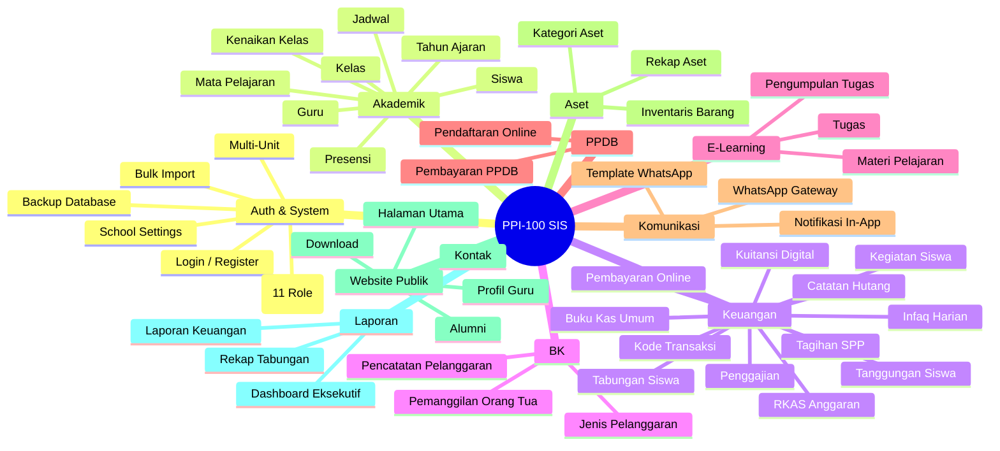
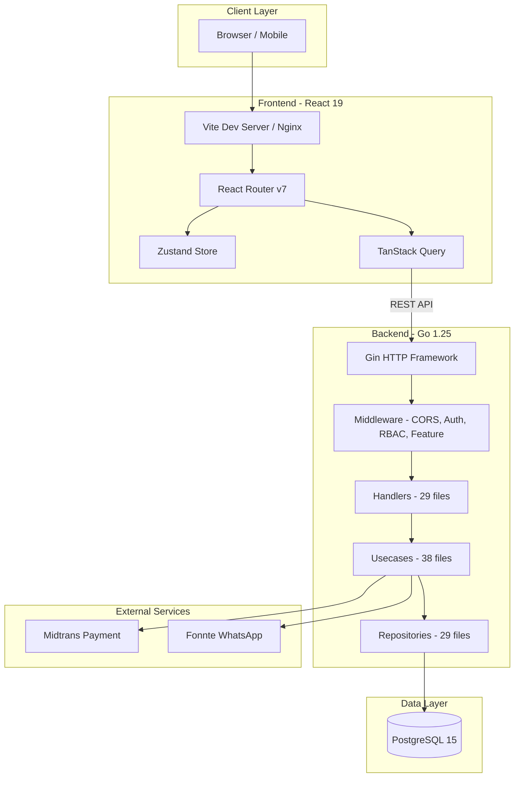
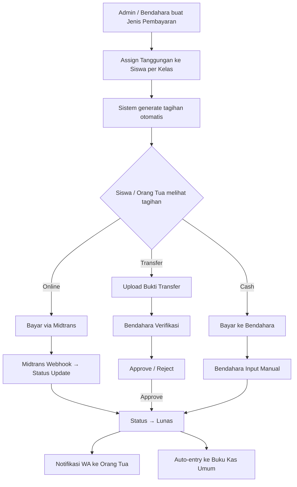
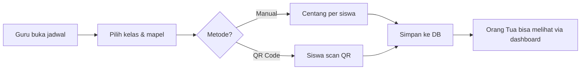
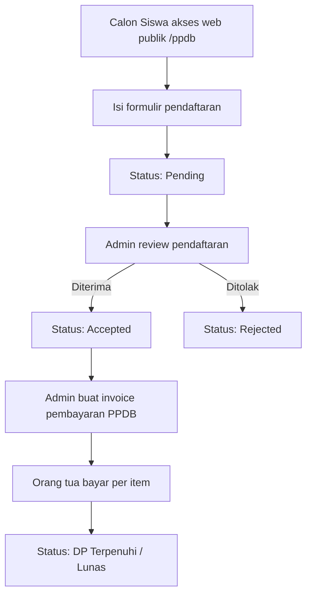
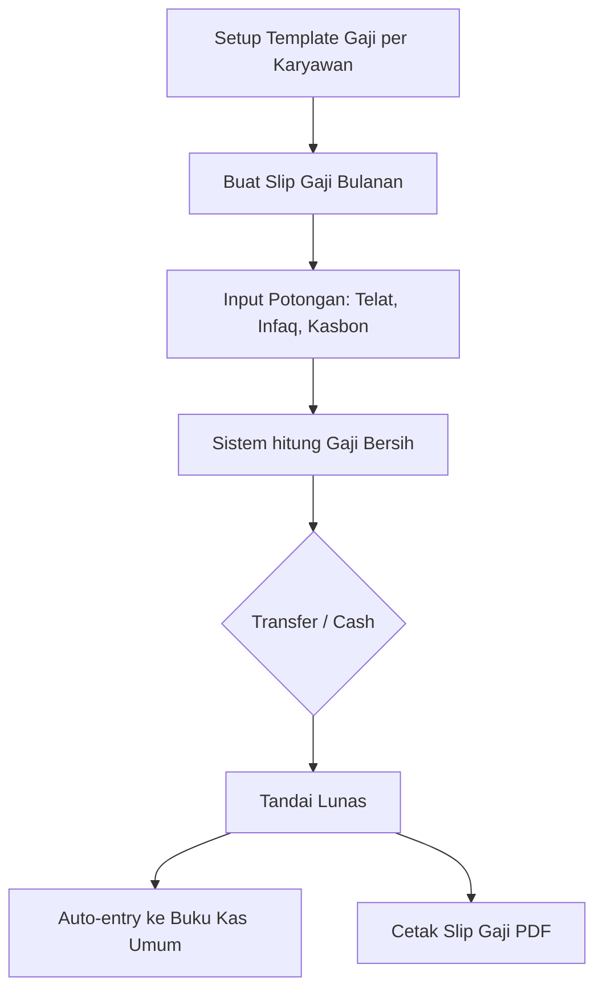
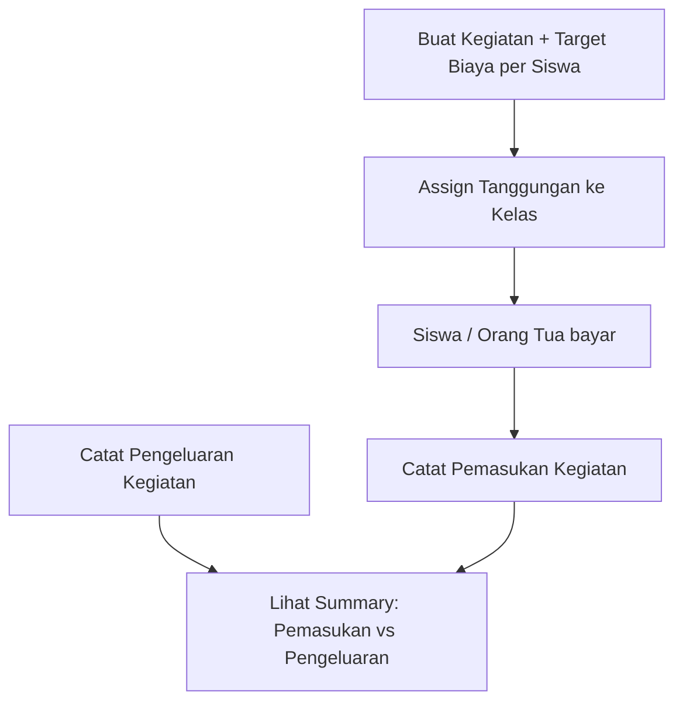
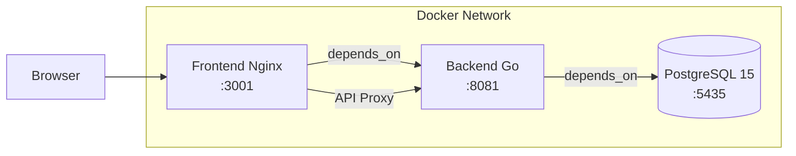

# Project Documentation — PPI-100 School Information System

**Versi Dokumen**: 1.0  
**Tanggal**: 24 April 2026  
**Nama Proyek**: SDIT-AN-NUR (School Information System)  
**Module Name**: `SDIT-Finance`

---

## 1. Informasi Proyek

### 1.1 Deskripsi
PPI-100 SIS adalah Sistem Informasi Sekolah terpadu yang dirancang untuk mendigitalisasi seluruh aspek operasional sekolah di bawah Yayasan PPI 100, mencakup manajemen akademik, keuangan, BK, e-learning, PPDB, komunikasi, dan website publik. Sistem dirancang sebagai **SaaS multi-tenant** yang mendukung beberapa unit sekolah (MTS, MA, SDIT) dalam satu platform.

### 1.2 Tujuan
- Mengintegrasikan seluruh proses bisnis sekolah dalam satu platform digital
- Menyediakan transparansi keuangan untuk pimpinan dan orang tua
- Mengotomasi proses administratif (tagihan, penggajian, PPDB)
- Memfasilitasi komunikasi sekolah-orang tua melalui WhatsApp

### 1.3 Stakeholder

| Peran | Kepentingan |
|-------|-------------|
| Yayasan / Pimpinan | Monitoring keuangan, persetujuan RKAS |
| Kepala Sekolah | Pengelolaan akademik dan operasional |
| Bendahara | Pengelolaan keuangan harian |
| Tata Usaha | Administrasi data dan aset |
| Guru / Wali Kelas | Input nilai, presensi, monitoring siswa |
| Orang Tua | Monitoring akademik dan keuangan anak |
| Siswa | Akses jadwal, nilai, tagihan, e-learning |
| Developer | Pengembangan dan pemeliharaan sistem |

---

## 2. Scope & Fitur

### 2.1 Daftar Modul (10 Modul Utama)



### 2.2 Statistik Proyek

| Metrik | Jumlah |
|--------|--------|
| Modul Utama | 10 |
| Tabel Database | 43+ |
| API Endpoint | 150+ |
| Halaman Frontend | 73+ |
| Custom Hooks | 10 |
| Backend Handlers | 29 |
| Backend Usecases | 38 (termasuk test) |
| Backend Repositories | 29 |
| Feature Flags | 16 |
| User Roles | 11 |

---

## 3. Arsitektur & Teknologi

### 3.1 Architecture Overview



### 3.2 Technology Summary

| Layer | Technology |
|-------|-----------|
| Frontend | React 19 + TypeScript + Vite 7 |
| Styling | TailwindCSS 3 + Framer Motion |
| State | Zustand (global) + TanStack Query (server) |
| Backend | Go 1.25 + Gin + GORM |
| Database | PostgreSQL 15 |
| Auth | JWT (httpOnly cookie) + Bcrypt |
| Payment | Midtrans Snap |
| Messaging | Fonnte WhatsApp API |
| Deploy | Docker Compose + Nginx |

---

## 4. Struktur Proyek

```
ppi-100-sis/
├── docker-compose.yml        # Orchestration (3 services)
├── Makefile                   # Build shortcuts
├── .env                       # Root environment
│
├── backend/
│   ├── Dockerfile             # Multi-stage Go build
│   ├── .env / .env.example    # Backend config
│   ├── go.mod / go.sum        # Dependencies
│   ├── cmd/                   # Entry points
│   │   ├── api/               # Main HTTP server
│   │   ├── init_app/          # Initial app setup
│   │   ├── init_admin/        # Admin seeder
│   │   ├── seeder/            # Data seeder
│   │   └── ...
│   ├── internal/              # Core application
│   │   ├── config/            # Environment config
│   │   ├── domain/            # 13 model files
│   │   ├── usecase/           # 38 business logic files
│   │   ├── repository/        # 29 data access files
│   │   └── delivery/http/     # Handlers, routes, middleware
│   ├── pkg/                   # Shared packages
│   └── uploads/               # File uploads
│
├── frontend/
│   ├── Dockerfile             # Multi-stage React build
│   ├── nginx.conf             # Production server config
│   ├── package.json           # Dependencies
│   ├── vite.config.ts         # Build config
│   ├── tsconfig.json          # TypeScript config
│   └── src/
│       ├── App.tsx            # Root + routing (279 lines)
│       ├── context/           # Auth, AcademicYear contexts
│       ├── store/             # Zustand stores
│       ├── hooks/             # 10 custom hooks
│       ├── services/          # API client (Axios)
│       ├── types/             # TypeScript definitions
│       ├── components/        # Reusable components
│       └── pages/             # 73+ page components
│
└── deploy/                    # Deployment scripts
```

---

## 5. Alur Kerja Modul (Workflow)

### 5.1 Alur Keuangan — Tagihan SPP



### 5.2 Alur Akademik — Presensi



### 5.3 Alur PPDB



### 5.4 Alur Penggajian



### 5.5 Alur Kegiatan Siswa



---

## 6. Setup & Instalasi

### 6.1 Prasyarat
- Docker & Docker Compose
- Node.js 20+ (untuk development frontend)
- Go 1.25+ (untuk development backend)
- PostgreSQL 15 (jika tidak menggunakan Docker)

### 6.2 Quick Start (Docker)

```bash
# 1. Clone repository
git clone <repository-url>
cd SDIT-Keuangan

# 2. Salin dan edit environment variables
cp backend/.env.example backend/.env
# Edit backend/.env dengan konfigurasi Anda

# 3. Build & jalankan semua services
make build

# 4. Akses aplikasi
# Frontend: http://localhost:3001
# Backend API: http://localhost:8081
```

### 6.3 Development Mode

**Backend:**
```bash
cd backend
cp .env.example .env
# Edit .env

# Jalankan server
go run cmd/api/main.go

# Inisialisasi data awal
go run cmd/init_app/main.go
go run cmd/init_admin/main.go
go run cmd/seeder/main.go
```

**Frontend:**
```bash
cd frontend
npm install
npm run dev
# Akses: http://localhost:5173
```

### 6.4 Environment Variables Penting

| Variable | Deskripsi | Contoh |
|----------|-----------|--------|
| `DB_HOST` | Host database | `localhost` |
| `DB_PASSWORD` | Password database | `secretpassword` |
| `DB_NAME` | Nama database | `sdit_management` |
| `JWT_SECRET` | Secret key JWT (min 32 karakter) | `random-string-32-chars` |
| `MIDTRANS_SERVER_KEY` | Server key Midtrans | `Mid-server-xxx` |
| `FONNTE_TOKEN` | Token API Fonnte | `your-token` |
| `SCHOOL_NAME` | Nama sekolah | `SDIT-AN-NUR` |
| `ENABLED_UNIT_IDS` | Unit yang aktif | `1,2,3` |

---

## 7. Konvensi Pengembangan

### 7.1 Backend (Go)
- **Pattern**: Clean Architecture (Domain → Usecase → Repository → Handler)
- **Naming**: snake_case untuk file, CamelCase untuk struct dan fungsi
- **Error Handling**: Return error dari usecase, handler mengirim HTTP response
- **Database**: GORM Auto-Migrate (tanpa file migration manual)
- **UUID**: Digunakan untuk semua primary key entity utama

### 7.2 Frontend (React/TypeScript)
- **Pattern**: Pages → Components → Hooks → Services
- **State**: Zustand untuk auth/UI state, TanStack Query untuk server state
- **Routing**: React Router v7, nested routes di bawah `/dashboard/*`
- **Naming**: PascalCase untuk komponen, camelCase untuk hooks
- **API**: Centralized Axios instance di `services/api.ts`

### 7.3 Git Workflow
- File `.gitignore` mengecualikan: `node_modules`, `.env`, binary builds, `.DS_Store`

---

## 8. Deployment

### 8.1 Docker Compose Architecture



### 8.2 Port Mapping

| Service | Internal Port | External Port |
|---------|--------------|---------------|
| PostgreSQL | 5432 | 5435 |
| Backend | 8080 | 8081 |
| Frontend | 80 | 3001 |

### 8.3 Production Build
- **Backend**: Multi-stage Docker build (Go compile → Alpine runtime)
- **Frontend**: Vite build → Nginx static serving

---

## 9. Risiko & Mitigasi

| Risiko | Dampak | Mitigasi |
|--------|--------|----------|
| Data loss | Tinggi | Fitur backup database built-in |
| Unauthorized access | Tinggi | JWT + RBAC + httpOnly cookie |
| Payment fraud | Tinggi | Midtrans webhook verification + manual approval |
| Invoice forgery | Sedang | HMAC-SHA256 digital signature + verification page |
| Feature creep | Sedang | Feature flags untuk on/off modul |
| Performance | Sedang | Database indexing, query optimization |

---

## 10. Roadmap & Status

### Fitur Aktif (Default ON)
- ✅ Authentication & RBAC
- ✅ Manajemen Akademik
- ✅ Billing & Pembayaran
- ✅ Tanggungan Siswa
- ✅ Midtrans Payment Gateway
- ✅ Tabungan Siswa
- ✅ Buku Kas Umum
- ✅ Infaq Harian
- ✅ Kegiatan Siswa
- ✅ PPDB
- ✅ WhatsApp Gateway
- ✅ Website Publik
- ✅ Kuitansi Digital

### Fitur Tersedia (Default OFF — perlu diaktifkan)
- ⬜ Penggajian (Payroll)
- ⬜ RKAS / RAB (Anggaran)
- ⬜ Manajemen Aset
- ⬜ Catatan Hutang Pihak Ketiga
- ⬜ E-Learning
- ⬜ Bimbingan Konseling (BK)

---

## 11. Kontak & Referensi

### File Penting
| File | Lokasi | Deskripsi |
|------|--------|-----------|
| Backend Entry | `backend/cmd/api/main.go` | Entry point server |
| Domain Models | `backend/internal/domain/` | Semua definisi entity |
| Routes | `backend/internal/delivery/http/routes/` | Semua endpoint API |
| Config | `backend/internal/config/config.go` | Konfigurasi aplikasi |
| Frontend Entry | `frontend/src/App.tsx` | Root component + routing |
| Types | `frontend/src/types/index.ts` | TypeScript type definitions |
| API Client | `frontend/src/services/api.ts` | Axios configuration |
| Auth Store | `frontend/src/store/authStore.ts` | Authentication state |

### Dokumentasi Terkait
- `docs/01_technical_documentation.md` — Dokumentasi teknis detail
- `docs/02_user_documentation.md` — Panduan pengguna
- `docs/03_project_documentation.md` — Dokumen ini
