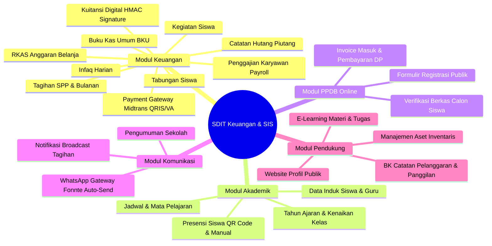
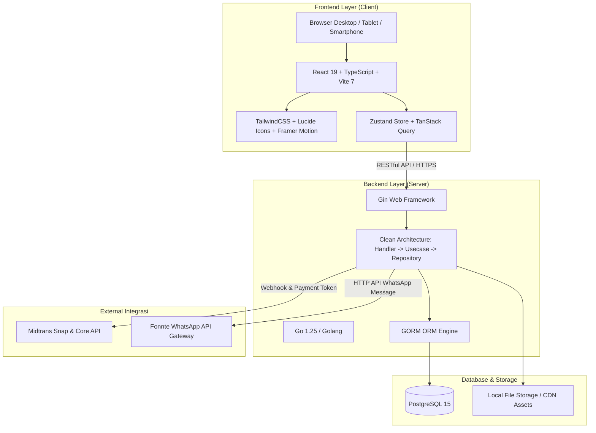
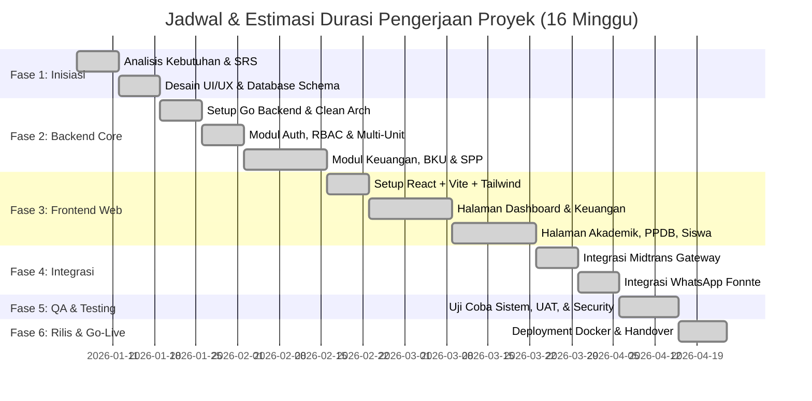

# DOKUMENTASI PROYEK SISTEM INFORMASI SEKOLAH & MANAJEMEN KEUANGAN (SDIT-KEUANGAN / SIS TERPADU)

---

## 1. Project Overview (Gambaran Umum)

### 1.1 Latar Belakang & Deskripsi
**SDIT-Keuangan (PPI-100 School Information System)** adalah platform digital terpadu berbasis web yang dirancang khusus untuk mengotomasi dan mendigitalisasi tata kelola administrasi akademik, operasional, dan manajemen keuangan institusi pendidikan Islam (SDIT, MTS, MA di bawah naungan yayasan).

Sistem ini mengadopsi arsitektur **SaaS Multi-Tenant / Multi-Unit**, memungkinkan pengelolaan beberapa unit sekolah secara independen namun tetap berada dalam satu kendali terpusat bagi pimpinan yayasan. Fokus utama sistem adalah menciptakan transparansi arus kas, mempermudah wali murid dalam bertransaksi secara non-tunai (cashless), memangkas beban kerja bendahara/tata usaha, serta mengintegrasikan gerbang pembayaran (*Payment Gateway*) dan notifikasi otomatis WhatsApp.

### 1.2 Tujuan Utama Proyek
- **Sentralisasi Data & Multi-Unit**: Mengintegrasikan database siswa, guru, akademik, dan kas antar-unit dalam satu payung platform.
- **Otomasi Penagihan & Pembayaran**: Menghilangkan pencatatan manual SPP dengan fitur *auto-billing*, tagihan per kelas, integrasi pembayaran instan (QRIS, VA Bank), serta kuitansi digital terverifikasi.
- **Transparansi Arus Kas Real-Time**: Menyajikan pembukuan Buku Kas Umum (BKU), infaq harian, tabungan siswa, dan laporan anggaran (RKAS) yang dapat diaudit sewaktu-waktu oleh pimpinan.
- **Komunikasi Cepat & Responsif**: Menghubungkan sekolah dengan orang tua siswa secara otomatis melalui notifikasi WhatsApp Gateway dan portal wali murid.

### 1.3 Pengguna Sistem (11 Level Role / RBAC)
1. **Super Admin**: Akses penuh ke seluruh konfigurasi multi-unit, user management, feature flags, dan database backup.
2. **Pimpinan Yayasan**: Monitoring dashboard eksekutif, laporan keuangan lintas unit, dan persetujuan RKAS.
3. **Kepala Sekolah**: Manajemen operasional sekolah, presensi, kurikulum, dan rekapitulasi akademik.
4. **Bendahara / Finance**: Pengelolaan tagihan SPP, tabungan, BKU, verifikasi transfer, infaq, dan penggajian.
5. **Tata Usaha (TU)**: Administrasi data induk siswa, guru, surat-menyurat, dan inventaris aset.
6. **Guru / Pendidik**: Input absensi (manual/QR code), penilaian mata pelajaran, materi, dan tugas e-learning.
7. **Wali Kelas**: Monitoring perkembangan santri/siswa, rekap nilai kelas, dan catatan disiplin.
8. **Guru BK (Bimbingan Konseling)**: Pencatatan pelanggaran, poin kedisiplinan, dan penerbitan surat panggilan orang tua.
9. **Panitia PPDB**: Pengelolaan calon siswa baru, verifikasi berkas formulir, dan penagihan biaya masuk.
10. **Orang Tua / Wali Murid**: Akses tagihan anak, riwayat pembayaran, tabungan, dan informasi kehadiran.
11. **Siswa**: Akses jadwal pelajaran, tugas e-learning, materi, dan status administrasi.

---

## 2. Fitur-Fitur Utama (Features Breakdown)



### 2.1 Modul Keuangan & Pembayaran (*Core Module*)
- **Manajemen Tagihan & Tanggungan Siswa**: Pengaturan nominal biaya SPP, uang gedung, kegiatan, atau seragam per tingkat kelas / per siswa dengan periode fleksibel (bulanan atau tahunan).
- **Multi-Metode Pembayaran**:
  - *Online (Payment Gateway Midtrans)*: Pembayaran otomatis via QRIS (GoPay, OVO, ShopeePay, Dana) dan Virtual Account (BCA, Mandiri, BNI, BRI, Permata). Status tagihan otomatis terupdate lunas (*real-time webhook*).
  - *Transfer Manual*: Siswa/wali mengunggah bukti struk transfer untuk diverifikasi dan disetujui bendahara.
  - *Pembayaran Tunai di Lokasi*: Pencatatan langsung oleh kasir/bendahara sekolah.
- **Kuitansi Digital & Tanda Tangan Kriptografi**: Pembuatan bukti pembayaran otomatis dalam format PDF berstandar rapi yang dilengkapi kode verifikasi QR Code dengan tanda tangan digital **HMAC-SHA256** guna mencegah pemalsuan bukti bayar.
- **Tabungan Siswa**: Pencatatan saldo simpanan siswa (setor & tarik tunai) dengan buku mutasi saldo yang akurat dan dapat dicetak sewaktu-waktu.
- **Buku Kas Umum (BKU)**: Pembukuan arus kas masuk dan keluar secara ganda (*double-entry bookkeeping*), pengelompokan akun/pos transaksi, dan rekonsiliasi saldo kas/bank.
- **Infaq Harian / Shadaqah**: Pencatatan penerimaan infaq harian per kelas dan perorangan untuk mendukung kegiatan sosial keagamaan.
- **Anggaran Sekolah (RKAS / RAPBS)**: Penyusunan rencana kerja anggaran tahunan, pengajuan mata anggaran, dan monitoring realisasi serapan dana vs pagu anggaran.
- **Penggajian / Payroll Guru & Karyawan**: Perhitungan gaji pokok, tunjangan jabatan, insentif kehadiran, potongan kasbon, keterlambatan, hingga cetak slip gaji digital.

### 2.2 Modul Akademik & Kesiswaan
- **Manajemen Siswa & Rombongan Belajar (Rombel)**: Pengelolaan data NIS/NISN, data wali, riwayat kelas, mutasi, hingga mekanisme kelulusan dan kenaikan kelas massal (*bulk promotion*).
- **Presensi Terintegrasi (Dual-Mode)**: Pencatatan kehadiran harian menggunakan pemindaian **QR Code dinamis** lewat smartphone atau input manual oleh guru/wali kelas.
- **Manajemen Tenaga Pendidik (PTK)**: Basis data guru, NUPTK, penugasan mata pelajaran, dan jadwal mengajar mingguan.
- **Tahun Ajaran & Semester**: Konfigurasi kalender akademik aktif yang mengisolasi data transaksi dan nilai per periode ajaran.

### 2.3 Modul PPDB Online (Penerimaan Peserta Didik Baru)
- **Portal Pendaftaran Terbuka**: Calon wali santri dapat mengisi biodata siswa, mengunggah berkas identitas (KK, Akta Kelahiran), dan memilih jalur pendaftaran secara daring.
- **Validasi & Verifikasi Administrasi**: Panitia PPDB memverifikasi kelengkapan berkas secara online dengan status *Pending*, *Accepted*, atau *Rejected*.
- **Billing PPDB Bertahap**: Pembuatan invoice formulir pendaftaran, uang pangkal/DP, dan pelunasan bertahap yang terhubung ke modul kasir.

### 2.4 Modul Notifikasi & Komunikasi (WhatsApp Gateway)
- **Integrasi WhatsApp Gateway (Fonnte)**: Pengiriman pesan otomatis untuk:
  - Notifikasi tagihan baru dan pengingat jatuh tempo SPP.
  - Notifikasi bukti pembayaran sukses secara instan kepada nomor WhatsApp orang tua.
  - Pengumuman presensi ketidakhadiran siswa di sekolah.
- **Template Dinamis**: Template pesan yang dapat dikustomisasi dengan parameter dinamis seperti `{nama_siswa}`, `{nominal}`, `{bulan}`, dan `{link_kuitansi}`.

### 2.5 Modul Pendukung & Website Publik
- **Website Profil Publik**: Menampilkan profil institusi, visi-misi, galeri kegiatan, struktur tenaga pendidik, dan unduhan berkas penting.
- **Bimbingan Konseling (BK)**: Sistem poin kedisiplinan dan pencatatan pelanggaran siswa yang dapat mengenerate surat peringatan atau surat panggilan orang tua secara otomatis.
- **E-Learning Sederhana**: Distribusi materi pembelajaran digital dan penugasan daring untuk siswa.
- **Manajemen Aset & Inventaris**: Pencatatan barang milik sekolah, lokasi penempatan, kondisi fisik (baik/rusak), serta rekap nilai aset.

---

## 3. Teknologi yang Digunakan (Tech Stack & Architecture)

Sistem dibangun menggunakan standar arsitektur modern berkinerja tinggi (*high performance & clean architecture*) untuk menjamin keandalan, skalabilitas, dan keamanan data.



### 3.1 Spesifikasi Detail Stack Teknologi

| Komponen / Layer | Teknologi / Library | Deskripsi & Kegunaan |
|---|---|---|
| **Frontend Framework** | **React 19 + TypeScript** | Framework UI modern berbasis komponen dengan type safety penuh untuk meminimalisir error pada runtime. |
| **Build Tool** | **Vite 7** | Tool build generasi baru dengan waktu startup ultra cepat dan optimasi bundle production. |
| **Styling & UI** | **Tailwind CSS + Lucide React** | Desain antarmuka responsif (*mobile-first*), konsisten, modern, dilengkapi ratusan ikon vektor. |
| **Animasi & Interaksi** | **Framer Motion** | Animasi transisi halaman, modal, dan mikro-interaksi yang elegan untuk *user experience* terbaik. |
| **State Management** | **Zustand + TanStack Query (React Query)** | Zustand untuk state global UI/Auth lokal; TanStack Query untuk caching, sinkronisasi, dan optimasi request server. |
| **Backend Engine** | **Go (Golang) 1.25** | Bahasa pemrograman berkecepatan tinggi dengan konkurensi native (*goroutines*) dan footprint memori sangat hemat. |
| **HTTP Web Framework** | **Gin Framework** | Framework HTTP Go yang sangat cepat, handal, dan modular untuk REST API. |
| **ORM & Database Layer**| **GORM + PostgreSQL 15** | Object-Relational Mapping fleksibel terhubung ke basis data relasional PostgreSQL dengan UUID indexing. |
| **Autentikasi & Keamanan**| **JWT (HttpOnly Cookie) + Bcrypt** | Token otentikasi berbasis JSON Web Token tersimpan aman di cookie httpOnly untuk proteksi dari serangan XSS/CSRF. |
| **Verifikasi Kuitansi** | **HMAC-SHA256 Cryptography** | Algoritma validasi tanda tangan digital pada kuitansi dan dokumen transaksi sekolah. |
| **Payment Gateway** | **Midtrans Snap API** | Pembayaran otomatis 24 jam mendukung QRIS, Virtual Account bank nasional, e-wallet, dan gerai retail. |
| **WhatsApp Gateway** | **Fonnte API Engine** | Pengiriman notifikasi broadcast tagihan dan konfirmasi otomatis ke kontak wali santri. |
| **DevOps & Kontainerisasi**| **Docker, Docker Compose, Nginx** | Deployment multi-container terisolasi (PostgreSQL + Go API Server + Nginx Web Server). |

---

## 4. Estimasi & Durasi Pengerjaan Proyek

Proyek ini dirancang dan diselesaikan dalam **6 Tahapan Utama (Total Durasi: ~14 - 16 Minggu / 3.5 - 4 Bulan)** dengan metodologi pengembangan *Agile / Iterative Sprint*.



### Rincian Pembagian Fase Pengerjaan:

| Fase | Kegiatan Utama | Durasi | Output / Deliverables |
|---|---|:---:|---|
| **Fase 1: Analisis & Desain** | Wawancara proses bisnis keuangan sekolah, perancangan diagram ERD (43+ tabel), dan perancangan UI/UX Figma. | **2 Minggu** | Dokumen SRS, Skema ERD Database, Desain High-Fidelity UI/UX. |
| **Fase 2: Backend Core** | Setup Clean Architecture Go, implementasi 29 handlers, 38 usecases, enkripsi auth JWT, dan logika keuangan BKU/SPP. | **4 Minggu** | 150+ REST API Endpoints, Unit Test Logic Keuangan. |
| **Fase 3: Frontend Development** | Pembuatan 73+ halaman React TS, integrasi Zustand, pembuatan tabel interaktif, filter multi-unit, dan modal transaksi. | **4 Minggu** | Aplikasi Frontend responsif, halaman bendahara, siswa & wali. |
| **Fase 4: Integrasi Third-Party** | Integrasi webhook Midtrans Snap, setup WhatsApp API Fonnte, dan generator PDF kuitansi ber-QR HMAC. | **2 Minggu** | Fitur bayar QRIS/VA otomatis & notifikasi WhatsApp live. |
| **Fase 5: Testing & Audit (QA)** | Pengujian fungsional (UAT), stress testing, validasi kalkulasi mutasi kas, dan pengujian keamanan otorisasi RBAC. | **1.5 Minggu**| Laporan UAT, Bug Fixes, Security Checklist lolos verifikasi. |
| **Fase 6: Deployment & Handover** | Konfigurasi Docker Compose multi-service, Nginx reverse proxy, seeder data awal, dan pelatihan bagi bendahara & admin. | **1 Minggu** | Server Production Live, Video Panduan, Dokumen Manual. |

---

## 5. Gambar Hasil & Tampilan Antarmuka (UI Preview)

Berikut adalah visualisasi antarmuka aplikasi sistem yang telah dibangun:

### 5.1 Dashboard Manajemen Keuangan Sekolah (Administrator & Bendahara)
Tampilan panel utama bendahara untuk memantau ringkasan saldo kas, tagihan SPP tertunggak, arus kas bulanan, grafik pendapatan vs pengeluaran, serta daftar mutasi kas harian secara *real-time*.


---

### 5.2 Portal Pembayaran SPP & Kuitansi Digital Validasi QR
Antarmuka pengecekan tagihan bagi siswa dan orang tua. Menyediakan pilihan opsi bayar via QRIS atau Virtual Account, riwayat status lunas, serta *modal popup* kuitansi digital resmi berstempel dan ber-QR code verifikasi.


---

### 5.3 Website Publik & Portal Registrasi PPDB Online
Halaman depan publik sekolah yang memuat identitas lembaga, program unggulan, informasi pendaftaran siswa baru (PPDB Online), formulir registrasi interaktif, dan pengumuman sekolah.


---

## 6. Struktur Direktori Proyek

```
SDIT-Keuangan/
├── backend/                      # Service Backend (Golang 1.25)
│   ├── cmd/                      # Entrypoint aplikasi (api, seeder, init)
│   │   ├── api/main.go           # HTTP Server bootstrap
│   │   └── seeder/main.go        # Database Seeder
│   ├── internal/
│   │   ├── config/               # Environment & App Config
│   │   ├── delivery/http/        # Handlers, Middlewares & Routes
│   │   ├── domain/               # Model Entity & Database Structs (13 files)
│   │   ├── repository/           # PostgreSQL Query & GORM (29 files)
│   │   └── usecase/              # Business Logic & Rules (38 files)
│   ├── pkg/                      # Shared libraries (JWT, HMAC, WhatsApp, Midtrans)
│   ├── Dockerfile                # Docker Multi-stage Go
│   └── go.mod                    # Modul dependencies
│
├── frontend/                     # Service Frontend (React 19 + TypeScript)
│   ├── src/
│   │   ├── components/           # UI Components (Navbar, Sidebar, Modals, Forms)
│   │   ├── context/              # Auth & Academic Context
│   │   ├── hooks/                # 10 Custom React Hooks
│   │   ├── pages/                # 73+ Halaman Aplikasi
│   │   │   ├── admin/            # Panel Administrasi Master Data
│   │   │   ├── finance/          # Panel Manajemen Keuangan, BKU, SPP, Gaji
│   │   │   ├── teacher/          # Panel Presensi & Nilai Guru
│   │   │   ├── student/          # Portal Siswa & Tagihan
│   │   │   └── public/           # Landing Page & PPDB
│   │   ├── services/             # Axios API Client & Endpoints
│   │   ├── store/                # Zustand Global State
│   │   └── types/                # TypeScript Interfaces
│   ├── Dockerfile                # Docker Multi-stage Vite + Nginx
│   └── package.json              # Frontend dependencies
│
├── deploy/                       # Skrip deployment & Nginx proxy
├── docs/                         # Berkas dokumentasi proyek lengkap
└── docker-compose.yml            # Konfigurasi container orkestrasi
```

---

## 7. Kesimpulan & Nilai Tambah

Sistem **SDIT-Keuangan** memberikan solusi menyeluruh dalam transformasi digital tata kelola sekolah:
1. **Efisiensi Kerja**: Mengurangi waktu rekapitulasi kas dan pencatatan SPP hingga **80%**.
2. **Nol Kesalahan Pencatatan**: Rekonsiliasi transaksi otomatis dari payment gateway ke Buku Kas Umum.
3. **Pemberdayaan Orang Tua**: Orang tua santri dapat memantau tunggakan, membayar via ponsel kapan saja, dan mendapatkan notifikasi WhatsApp otomatis.
4. **Keamanan & Skalabilitas Tinggi**: Menggunakan Clean Architecture pada Go dan React 19 yang siap menampung ribuan siswa di banyak unit sekolah.
